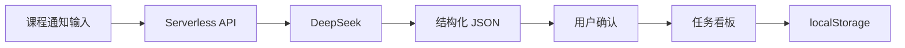

# AI Course Task System

> 将分散的课程通知自动解析为可确认、可追踪的结构化任务。

## 项目背景

- 课程通知散落在群聊、教学平台和邮件中。
- 作业、项目、DDL 与考试范围需要重复手工整理。
- 普通待办工具无法理解自然语言课程通知。

## 解决方案

输入完整课程通知后，系统通过 DeepSeek 将文本解析为结构化 JSON。用户确认结果后，每项作业或项目会进入 `Done / Today / Upcoming` 任务看板，并保存在浏览器本地。

## 产品原型

### 课程信息输入

### AI 解析结果

### 任务看板

## 系统架构

## 核心功能

- Prompt + JSON Schema 驱动的课程信息解析
- 作业、项目、DDL 和考试范围提取
- AI 结果回填、人工检查与确认
- `Done / Today / Upcoming` 自动分类
- 本地持久化、软删除与回收站
- 桌面、平板和移动端响应式布局
- 服务端环境变量管理 API Key

## 技术栈

- HTML5 / CSS3 / Vanilla JavaScript
- DeepSeek API
- Vercel Serverless Functions
- localStorage

## 本地运行

直接打开 `index.html` 可使用手动录入、看板和本地存储功能。AI 解析必须通过带有 Serverless API 的部署环境使用。

## 部署说明

部署和内测步骤见 [DEPLOYMENT.md](./DEPLOYMENT.md)。

## 演示视频

> GitHub 通常不会直接播放仓库中的 MP4 文件。请点击下方链接，在文件页面下载后观看。

- [下载功能演示视频（MP4，约 8.8 MB）](./docs/demo.mp4)
- 在线体验：等待 Vercel 账号审核后补充

## 设计稿

- [输入页原型](./docs/figma/course-input.png)
- [解析结果页原型](./docs/figma/ai-parse-result.png)
- [任务看板页原型](./docs/figma/task-board.png)
- Figma 在线设计稿：待补充公开链接

## 安全说明

前端不包含 DeepSeek API Key。请将新 Key 仅配置为服务端环境变量 `DEEPSEEK_API_KEY`，不要提交 `.env` 文件。

## 开源协议

[MIT](./LICENSE)
