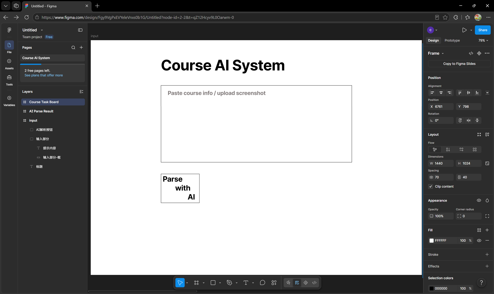
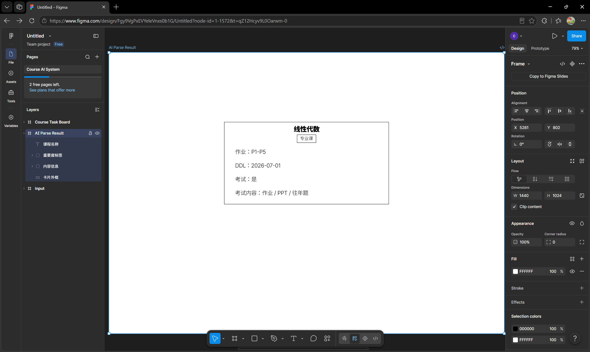
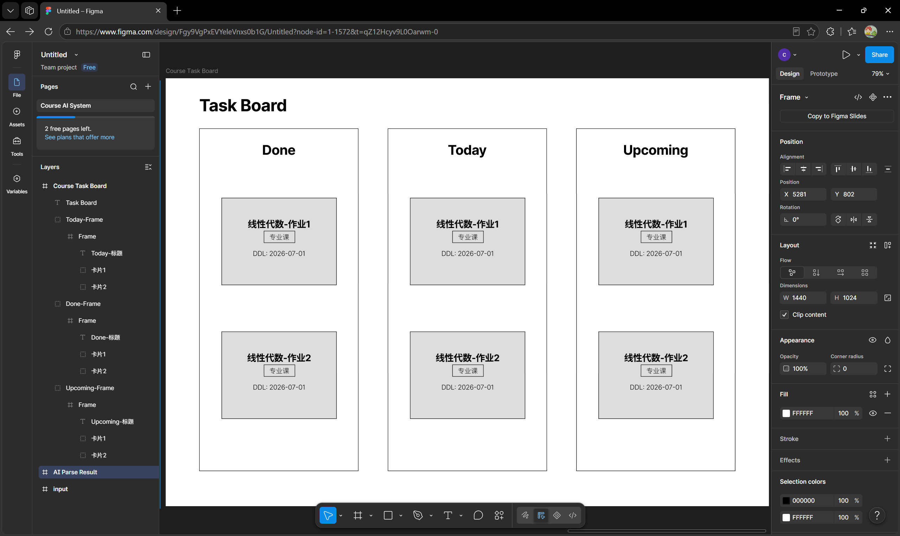
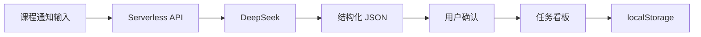

# AI Course Task System

> 将分散的课程通知自动解析为可确认、可追踪的结构化任务。

## 项目背景

- 课程通知散落在群聊、教学平台和邮件中。
- 作业、项目、DDL 与考试范围需要重复手工整理。
- 普通待办工具无法理解自然语言课程通知。

## 解决方案

用户登录后输入完整课程通知，系统通过 DeepSeek 将文本解析为结构化 JSON。用户确认结果后，每项作业或项目会进入 `Done / Today / Upcoming` 任务看板，并保存到本地 SQLite 后端。

## 产品原型

### 课程信息输入



### AI 解析结果



### 任务看板



## 系统架构



## 核心功能

- Prompt + JSON Schema 驱动的课程信息解析
- 作业、项目、DDL 和考试范围提取
- AI 结果回填、人工检查与确认
- `Done / Today / Upcoming` 自动分类
- 本地持久化、软删除与回收站
- 学号登录、首次登录强制改密、服务端 session
- 个人任务服务端保存、刷新持久化和账号隔离
- 桌面、平板和移动端响应式布局
- 服务端环境变量管理 API Key

## 技术栈

- HTML5 / CSS3 / Vanilla JavaScript
- DeepSeek API
- Vercel Serverless Functions
- Node.js 本地后端
- SQLite / better-sqlite3
- localStorage

## 本地运行

本地完整功能需要通过 Node.js 服务访问，不再建议直接打开 `index.html`。

1. 将 `.env.example` 复制为不会进入 Git 的 `.env.local`。
2. 在 `.env.local` 中填写新的 `DEEPSEEK_API_KEY`、`INITIAL_PASSWORD` 和至少一个内测账号配置。
3. 安装依赖：

```powershell
npm install
```

4. 执行：

```powershell
npm run start:env
```

5. 访问 `http://127.0.0.1:8000`。

本地服务使用 Node.js 20.6 或更高版本。不要把真实 Key、初始密码、学生名单或数据库文件写入 Git。

内测账号有两种创建方式：

- 单个 owner：设置 `PILOT_OWNER_STUDENT_ID`、`PILOT_OWNER_DISPLAY_NAME` 和 `INITIAL_PASSWORD`。
- 多个内测用户：设置 `PILOT_ROSTER_PATH=rosters/pilot-users.json`，该文件必须放在被 Git 忽略的 `rosters/` 目录中。

roster JSON 示例：

```json
[
    { "studentId": "24000001", "displayName": "内测用户一" },
    { "studentId": "24000002", "displayName": "内测用户二" }
]
```

若后续需要让同一热点中的手机访问，必须显式将 `.env.local` 中的 `HOST` 改为 `0.0.0.0`，并使用开发电脑的热点 IPv4 地址访问。只允许 Windows 防火墙的专用网络访问，不要开放到公网。

运行全部自动测试：

```powershell
npm test
```

当前阶段已新增 SQLite 结构基线、登录认证和个人任务 API。schema 位于 `server/db/schema.sql`。实际 `.db` / `.sqlite` 数据库文件、学生名单、会话文件和本地试点数据均被 Git 忽略，不能提交到公开仓库。

说明：当前服务端化的是“个人任务”。班级管理员发布共享任务、角色权限 UI 和完整 `localStorage` 批量迁移仍属于后续阶段。

## 部署说明

部署和内测步骤见 [DEPLOYMENT.md](./DEPLOYMENT.md)。

## 演示视频

> GitHub 通常不会直接播放仓库中的 MP4 文件。请点击下方链接，在文件页面下载后观看。

- [下载功能演示视频（MP4，约 8.8 MB）](./docs/demo.mp4)
- 在线体验：等待 Vercel 账号审核后补充

## 设计稿

- [输入页原型](./docs/figma/course-input.png)
- [解析结果页原型](./docs/figma/ai-parse-result.png)
- [任务看板页原型](./docs/figma/task-board.png)
- Figma 在线设计稿：待补充公开链接

## 安全说明

前端不包含 DeepSeek API Key。请将新 Key 仅配置为服务端环境变量 `DEEPSEEK_API_KEY`，不要提交 `.env` 文件。

## 开源协议

[MIT](./LICENSE)
